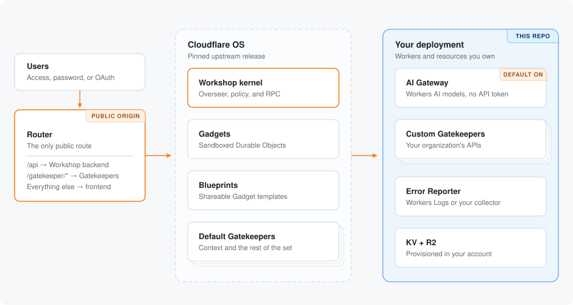

<p align="center">
  
</p>

<h1 align="center">cloudflare-os</h1>

<p align="center">
  Personal Cloudflare OS deployment for <a href="https://github.com/brendadeeznuts1111">brendadeeznuts1111</a>.
  Pins an upstream <a href="https://github.com/cloudflare/cloudflare-os">Cloudflare OS</a> release via
  <a href="https://github.com/cloudflare/cloudflare-os-starter">cloudflare-os-starter</a>
  so branding, Access, Gatekeepers, and upgrades stay under this repo's control.
</p>

<p align="center">
  <a href="https://developers.cloudflare.com/workers/"></a>
  <a href="https://nodejs.org/"></a>
  <a href="https://pnpm.io/"></a>
  <a href="https://github.com/cloudflare/cloudflare-os"></a>
  <a href="https://github.com/cloudflare/cloudflare-os/blob/main/LICENSE"></a>
</p>

> [!IMPORTANT]
> Cloudflare OS is early-access software (v2, August 2026). Pin upstream releases, review changes, and verify the trust boundary before every production upgrade. This repository does **not** patch the core — it consumes a pinned submodule.

## What this is

Cloudflare OS is not Windows, Linux, or macOS. It is an open-source **AI workspace** Cloudflare built for its own employees and released so other organizations can deploy *Your Company OS*.

It gives you:

1. An **agent chat workspace** grounded in company context and skills
2. **Gadgets** — sandboxed personal apps (each a Dynamic Worker + Durable Object Facet with its own SQLite)
3. **Gatekeepers** — capability-based connectors that hold credentials, simulate writes, and queue human approval

This repo is a starter-based deployment wrapper: six Workers, your `deployment.jsonc`, and a pinned `cloudflare-os` submodule.

## Official documentation

There is no `developers.cloudflare.com/cloudflare-os` product doc yet. Use these official sources:

| Source | URL |
| --- | --- |
| Product site | https://os.cloudflare.app |
| Hosted one-click deploy | https://os.cloudflare.app/deploy |
| Announcement | https://blog.cloudflare.com/cloudflare-os/ |
| Core (do not patch) | https://github.com/cloudflare/cloudflare-os |
| Official starter (this repo is seeded from) | https://github.com/cloudflare/cloudflare-os-starter |
| How this deployment is built | [docs/architecture.md](docs/architecture.md) |
| Starter customization | [docs/customization.md](docs/customization.md) |
| Observability | [docs/observability.md](docs/observability.md) |
| Migrate from hosted deploy | [docs/migrate-from-hosted.md](docs/migrate-from-hosted.md) |
| Blueprints | https://github.com/cloudflare/cloudflare-os/blob/main/docs/blueprints.md |
| Sharing | https://github.com/cloudflare/cloudflare-os/blob/main/docs/sharing.md |
| Observers | https://github.com/cloudflare/cloudflare-os/blob/main/docs/observers.md |
| OAuth sign-in | https://github.com/cloudflare/cloudflare-os/blob/main/docs/oauth-signin.md |
| Durable Objects | https://developers.cloudflare.com/durable-objects/ |
| Dynamic Workers | https://blog.cloudflare.com/dynamic-workers/ |
| Facets | https://blog.cloudflare.com/durable-object-facets-dynamic-workers/ |
| AI Gateway | https://developers.cloudflare.com/ai-gateway/ |
| Cloudflare Access | https://developers.cloudflare.com/cloudflare-one/access-controls/applications/http-apps/self-hosted-public-app/ |

## Architecture

The deployment is six Workers. A **router** owns the public route and serves the frontend, proxying `/api` to the Workshop backend and `/gatekeeper/<name>` to whichever Gatekeeper the binding name matches. The other five Workers have no public route.

| Worker | Role |
| --- | --- |
| `router` | Only public route; frontend + proxies |
| `workshop` | Kernel / Durable Object backend |
| `context` | Context Gatekeeper |
| `scheduler` | Scheduled and recurring agent work |
| `customGatekeeper` | Your organization integration |
| `errorReporter` | Private structured error destination |



## Four steps to deploy

1. Install dependencies and run `pnpm exec wrangler login`.
2. Fill in `deployment.jsonc`: account ID, Worker names, hostname, Access audience, admin emails. Placeholders are still present until those values exist.
3. Run `pnpm check`, then `pnpm deploy`.
4. Open `/admin` and set the site name, logo, and accent color; branding needs no redeploy.

### 1. Prepare the workspace

Install [Node.js 24.19 or newer](https://nodejs.org/) (the deploy scripts are TypeScript run directly by `node`) and [pnpm 11.17](https://pnpm.io/installation):

```sh
# Pinned core commit: 6478a1448a11524e2f7c2575ad66fab0bc47c433
git submodule update --init
# If that fails because the gitlink is missing on a fresh seed:
#   git submodule add https://github.com/cloudflare/cloudflare-os.git cloudflare-os
#   git -C cloudflare-os checkout 6478a1448a11524e2f7c2575ad66fab0bc47c433
# Restore lockfile + generated wrangler types from the official starter
bash scripts/sync-upstream-generated.sh
pnpm install
pnpm --dir cloudflare-os install
pnpm exec wrangler login
```

Your account needs [Workers](https://developers.cloudflare.com/workers/), [KV](https://developers.cloudflare.com/kv/), [R2](https://developers.cloudflare.com/r2/), [Browser Rendering](https://developers.cloudflare.com/browser-rendering/), and [Dynamic Worker Loaders](https://developers.cloudflare.com/workers/runtime-apis/bindings/worker-loader/). It also needs [Workers AI](https://developers.cloudflare.com/workers-ai/) and [AI Gateway](https://developers.cloudflare.com/ai-gateway/) for the default model catalog. [Artifacts](https://developers.cloudflare.com/artifacts/) is optional.

### 2. Configure sign-in

This starter deploys [Cloudflare Access](https://developers.cloudflare.com/cloudflare-one/access-controls/applications/http-apps/self-hosted-public-app/) mode. See [Sign-in methods](docs/customization.md#sign-in-methods) for alternatives.

1. Choose a public hostname in an [active Cloudflare zone](https://developers.cloudflare.com/dns/zone-setups/), such as `os.example.com`.
2. Create a [self-hosted Access application](https://developers.cloudflare.com/cloudflare-one/access-controls/applications/http-apps/self-hosted-public-app/) for that hostname.
3. Copy its [application audience tag](https://developers.cloudflare.com/cloudflare-one/access-controls/applications/http-apps/authorization-cookie/validating-json/#get-your-aud-tag).
4. Open [`deployment.jsonc`](deployment.jsonc) and replace the placeholders.

The router is already on `{ "workersDev": true }`. Set `publicBaseUrl` to the resulting origin (for example `https://brenda-os-router.<account>.workers.dev`).

### 3. Validate and deploy

```sh
pnpm check
pnpm deploy
```

Leave resource IDs as `null` to let Wrangler provision KV and R2 on first deploy.

### 4. Verify

- Open the router hostname and confirm Access is the only public way in.
- Open `/admin` as an administrator and set Context, Scheduler, and Custom Gatekeepers to disabled, optional, or enabled.
- Enable the Custom Gatekeeper, ask for deployment information, and confirm the read appears as an observation.
- Ask an agent to schedule something a few minutes out to exercise the Scheduler Gatekeeper.

## Run locally (no Cloudflare account)

The pinned core can run on `workerd` via Wrangler without deploying:

```sh
git submodule update --init
pnpm --dir cloudflare-os install
pnpm --dir cloudflare-os run-local
```

Then visit http://localhost:8787

This is for trying the product, not production. Data is stored under `cloudflare-os/.wrangler`.

## Deploy status for this checkout

Worker names (`brenda-os-*`), a `workers.dev` evaluation route, and Custom Gatekeeper branding are filled. Still required before `pnpm deploy`: `accountId`, `publicBaseUrl`, Access issuer/audience/admin email, and `wrangler login`. The full remaining-steps list is in [DEPLOY.md](DEPLOY.md).

Production deploy also needs a Cloudflare account with Workers, KV, R2, Browser Rendering, Dynamic Worker Loaders, Workers AI, and AI Gateway.

Fastest hosted path (no repo): [os.cloudflare.app/deploy](https://os.cloudflare.app/deploy). Use this repository when you want custom Gatekeepers, your own domain, or a pinned upgrade you control. If you start hosted and eject later, follow [Migrating from the hosted deploy](docs/migrate-from-hosted.md).

## Customization

| Customize | Best place | Deploy required |
| --- | --- | --- |
| Site name, logo, color, announcements, instructions, connectors | `/admin` | No |
| Sign-in, routes, AI, storage, observability, Worker identities | [`deployment.jsonc`](deployment.jsonc) | Yes |
| Logs, traces, error destinations, browser reporting | [Observability guide](docs/observability.md) | Sometimes |
| Organization APIs and capabilities | [`packages/custom-gatekeeper`](packages/custom-gatekeeper/README.md) | Yes |
| Product behavior unavailable through Worker boundaries | Pinned upstream fork/commit | Yes |

The complete control reference lives in [Customization](docs/customization.md). The upstream [`write-gatekeeper` skill](https://github.com/cloudflare/cloudflare-os/blob/main/.agents/skills/write-gatekeeper/SKILL.md) covers richer integrations.

## Operations and upgrades

- Stream production events with [`wrangler tail`](https://developers.cloudflare.com/workers/observability/logs/real-time-logs/).
- Triage explicit failures with the [observability guide](docs/observability.md).
- Roll a Worker back from its dashboard history or [`wrangler rollback`](https://developers.cloudflare.com/workers/versions-and-deployments/rollbacks/).
- Follow the [upgrade checklist](docs/customization.md#upgrade) before changing the pinned submodule.

## License

Apache-2.0, same as [upstream Cloudflare OS](https://github.com/cloudflare/cloudflare-os) and the official starter.
